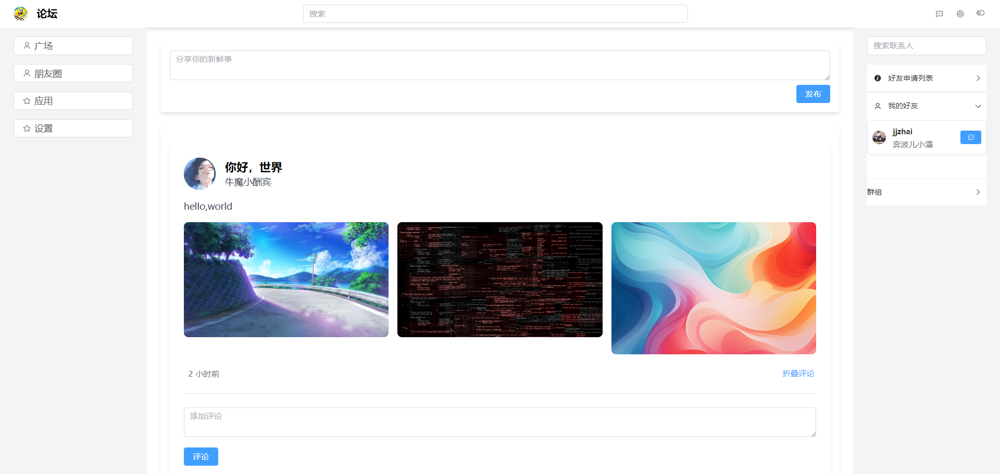

# forum-actix-web

一个使用vue3+actix-web+postgres搭建的论坛网站项目

## 当前支持的功能

1. 用户注册和登录。
2. 博文的发送以评论功能，评论支持嵌套回复。
3. 添加好友功能。
4. 好友聊天功能，基于websocket，不提供聊天记录保存。（为了个人隐私，其实是嫌麻烦，哈哈）
5. markdown文章的写作和预览，可以用来发表自己的文章，支持图片的拖入和粘贴。

## 计划添加功能

1. 管理员系统。
2. 博文和文章的分类（公开 私密 好友可见）。
3. 个人主页。
4. markdown文章分类和评论。
5. 手机端的ui适配。

## 示例图片

